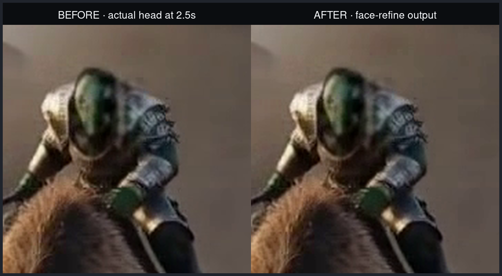
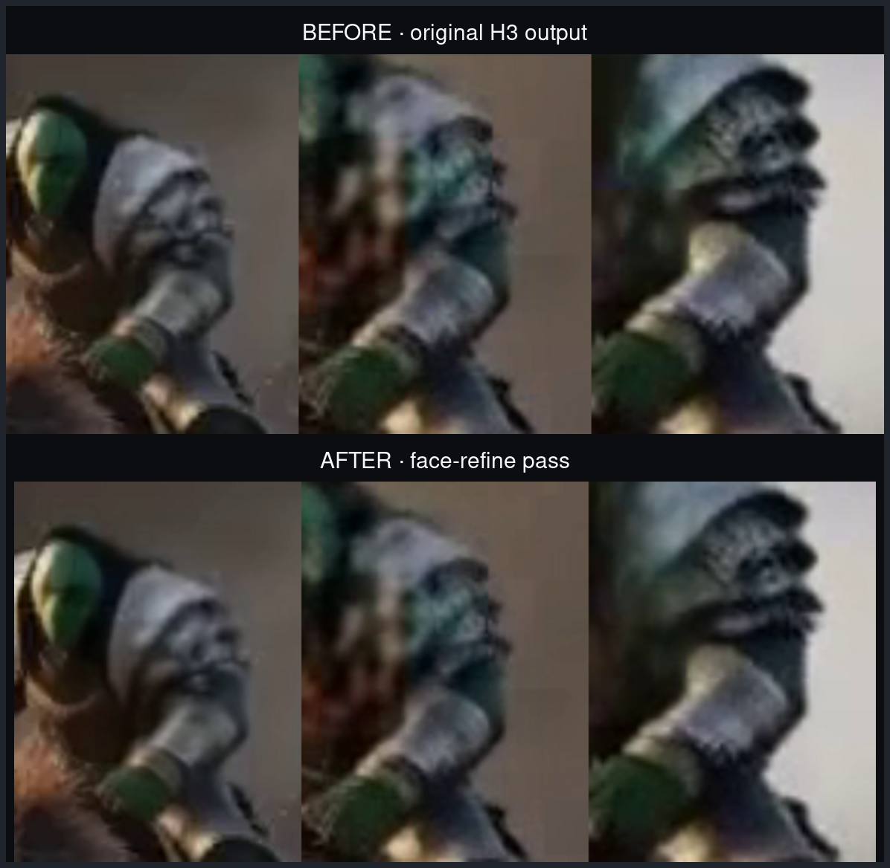

# H3 face-refine A/B — 2026-08-26

The controlled run used the same 896×512, 5.18-second H3 video before and
after the optional FL2VA face-refine workflow. First, this is the same fixed
180×180 crop around the actual head at 2.5 seconds, enlarged without
sharpening:

There is no meaningful recovery of facial detail. More importantly, the three
sampled regions that the detector/tracker actually selected are below:

## Result

The detector/tracker latched onto the orc's shoulder and helmet rather than a
stable face. The generated pass then made that already incorrect region
smoother. Across all 124 decoded frames, the median tracked-region metrics
were:

| Metric | Before | After | Change |
| --- | ---: | ---: | ---: |
| Laplacian variance (edge sharpness) | 1908.54 | 1397.84 | -26.8% |
| High-frequency energy ratio | 0.000995 | 0.000855 | -14.1% |
| 95th-percentile saturation | 0.5804 | 0.6177 | +6.4% |

This is a failed quality gate: tracking is incorrect and neither sharpness
metric improved. Production now keeps the primary clip unless a bounded
five-frame preview passes both an objective detail-gain test and a separately
labelled two-image DeepSeek vision comparison.

The older SDIF bumpy-image detector was reviewed as a possible rejection gate,
but its whole-image histogram threshold is not calibrated for cropped faces.
It should not be copied into production unchanged.

## Production preview-gate follow-up

The production worker was iterated through `face-judge-r7` with matched prompt,
seed, model and face frame. The final configuration uses a 2.2x tracked crop,
512px refinement canvas, full small-face denoise strength, and
`deepseek-v4-flash-vision-exp` on two separately labelled 512x512 A/B crops.

| Face height | Variant | Preview Laplacian ratio | DeepSeek | Outcome |
| ---: | --- | ---: | --- | --- |
| 5.1% | original crop / strength | 0.9741 | A, 0.90 | reject: no gain |
| 5.1% | 2.2x crop | 1.0544 | pre-fix contact sheet unreliable | reject |
| 5.1% | 2.2x crop + strength 1.0 | 1.1032 | A, 1.00, tie | reject |
| 9.2% | final r7 settings | 0.9765 | A, 0.90, no improvement | reject |
| 19.9%-38.0% | earlier representative policy | 0.7542 | A, 0.90 | reject: soft face |

The judge plumbing was positive/negative controlled: with the same portrait,
a heavily blurred A versus sharp B selects B at 0.90; identical A/B selects A
at 1.00. A separate Apache-2.0 RestoreFormer probe was also rejected because
it hallucinated identity and colour on the tiny face.

No tested candidate justified a full-video pass. Production therefore fails
closed, skips face-free clips, skips faces below 7% of frame height, and pays
for the full refinement only after both independent preview gates accept B.
On the matched 5.1% canary, that cutoff reduced face-stage time from 15.90s to
4.67s and total measured request time from 53.11s to 39.10s (26.4% faster),
while returning the unchanged primary clip.

## Dense and identity-conditioned H3 follow-up

Two higher-compute variants were then tested on production H100 workers. Both
used the same five-frame preview gate and returned the unchanged primary video.

| Variant | Face fraction | Steps | Preview Laplacian ratio | DeepSeek | Outcome |
| --- | ---: | ---: | ---: | --- | --- |
| Ref2VA + tracked crop as `<Picture 1>` | 39.7% | 12 | 0.8152 | A, 1.00, tie | reject: softer |
| Ref2VA + tracked crop as `<Picture 1>` | 30.3% | 12 | 0.7695 | A, 1.00, tie | reject: softer |
| FL2VA base + selected tracked keyframe, no turbo LoRA | 30.3% | 20 | 0.7726 | A, 1.00, tie | reject: softer |

This rules out both “use Ref2VA identity conditioning” and “give the H3 crop
pass more steps” as production fixes in their present form. The r9/r10 graphs
remain available behind `H3_FACE_REFINE_CONDITIONING` for controlled research,
but production was restored to the fail-closed r7 image.

## Recommended next architecture

The acceptance unit should be one identity track, not one video:

1. Detect every face on every frame, associate boxes with persistent identity
   embeddings, and split each identity into contiguous visibility windows.
2. Select the clearest, most frontal frame per identity as its reference. Build
   a landmark-aligned, subpixel-stabilised 512-768px face tube for that person.
3. Run candidate restorers on each tube independently. Never process a crowd as
   one crop and never let a “largest face” rule switch subjects.
4. Judge the worst, median, and motion-heavy frames for each identity, plus
   identity similarity and temporal flicker. Accept or reject each track
   independently and composite only accepted tracks.
5. Preserve original pixels for undetected windows, tiny faces with no usable
   reference, and every ambiguous result.

SeedVR2 is the next commercially usable model worth benchmarking on these
stabilised face tubes, not on whole videos. Its official Apache-2.0 weights are
usable in production, but its own model card warns about unpleasing generated
details and oversharpening lightly degraded inputs, so it must remain behind
the same per-track fail-closed gate. KEEP, PGTFormer, and the released SVFR
weights are useful research baselines but their published licences do not
permit this production use without separate permission.
